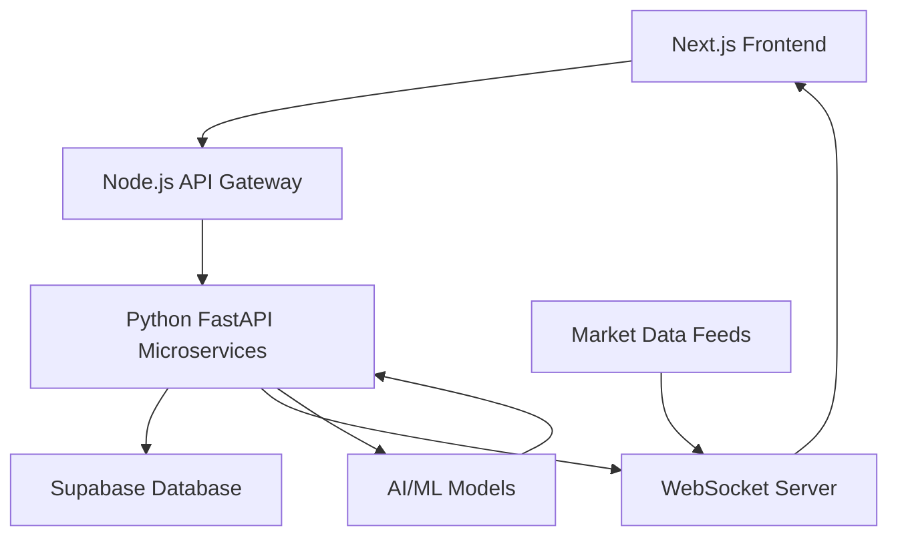

# TradeSync
# TradeSync - AI-Powered Trading Simulator


## 🚀 Overview

TradeSync is a cutting-edge trading simulation platform that combines real-time market data with AI-driven insights to create an immersive trading experience. Designed for both novice traders and seasoned professionals, our platform enables high-frequency strategy backtesting, collaborative trading rooms, and intelligent portfolio optimization with millisecond latency.

**Key Highlights:**
- 📈 Real-time trading simulation with historical data replay
- 🤖 AI-powered strategy recommendations and reinforcement learning
- ⚡ Ultra-low latency backend supporting thousands of concurrent trades
- 👥 Dynamic trading rooms for collaborative strategy development
- 📊 Advanced visualizations with sentiment analysis and explainable AI

## ✨ Features

### Core Trading Engine
- **Millisecond Latency Simulation**: Process real-time and historical data with sub-10ms latency
- **High-Frequency Backtesting**: Test strategies with tick-level precision across multiple asset classes
- **Portfolio Management**: Real-time P/L tracking, risk metrics, and performance analytics

### AI Integration
- **Strategy Recommendations**: ML models suggesting optimal trading strategies based on market conditions
- **Reinforcement Learning**: Adaptive models that learn from market patterns and user behavior
- **Sentiment Analysis**: Real-time market sentiment scoring from news and social media
- **Explainable AI Insights**: Transparent reasoning behind AI recommendations

### Real-Time Collaboration
- **Trading Rooms**: Create or join dynamic trading environments with real-time collaboration
- **Live Strategy Sharing**: Share and discuss strategies with other traders instantly
- **Performance Leaderboards**: Competitive ranking system across different trading styles

### Advanced Visualization
- **Interactive Charts**: Built with ReCharts and D3.js for comprehensive technical analysis
- **Real-Time Dashboards**: Live updating performance metrics and market data
- **Customizable Layouts**: Drag-and-drop interface for personalized workspace setup

## 🏗️ Architecture



### System Components

1. **Frontend Layer** (Next.js + TailwindCSS)
   - Responsive UI with real-time data visualization
   - Interactive trading interface with customizable dashboards
   - WebSocket client for live data streaming

2. **API Gateway** (Node.js)
   - Request routing and load balancing
   - Authentication and rate limiting
   - Microservice orchestration

3. **Microservices** (Python FastAPI)
   - **Trading Engine**: Order execution and portfolio management
   - **AI Service**: Strategy recommendations and ML model inference
   - **Data Service**: Market data processing and historical analysis
   - **WebSocket Server**: Real-time communication layer

4. **Data Layer** (Supabase)
   - User profiles and preferences
   - Trading history and strategy data
   - Market data caching and indexing

## 🛠️ Tech Stack

### Frontend
- **Framework**: Next.js 14+ with App Router
- **Styling**: TailwindCSS with custom design system
- **Charts**: ReCharts and D3.js for advanced visualizations
- **State Management**: Zustand for client-side state
- **Real-time**: WebSocket client with fallback mechanisms

### Backend
- **API Gateway**: Node.js with Express.js
- **Microservices**: Python FastAPI with async/await
- **WebSocket**: Custom WebSocket server for real-time communication
- **Authentication**: JWT with refresh token rotation

### AI/ML Infrastructure
- **Framework**: PyTorch/TensorFlow for model training
- **Reinforcement Learning**: Stable Baselines3 for strategy optimization
- **NLP**: Transformers for sentiment analysis
- **Feature Store**: Feast for ML feature management

### Data & Infrastructure
- **Database**: Supabase (PostgreSQL) with real-time subscriptions
- **Caching**: Redis for low-latency data access
- **Message Queue**: Redis Pub/Sub for event-driven architecture
- **Deployment**: Docker containers with Kubernetes orchestration

## 📦 Installation

### Prerequisites
- Node.js 18+ 
- Python 3.11+
- Docker and Docker Compose
- Supabase account

### Quick Start

1. **Clone the repository**
```bash
git clone https://github.com/yourusername/tradesync.git
cd tradesync
```

2. **Setup environment variables**
```bash
cp .env.example .env.local
# Configure your Supabase and API keys
```

3. **Install dependencies**
```bash
# Frontend
cd frontend && npm install

# Backend
cd ../backend && pip install -r requirements.txt
```

4. **Run with Docker**
```bash
docker-compose up --build
```

### Development Setup

**Frontend Development:**
```bash
cd frontend
npm run dev
```

**Backend Development:**
```bash
cd backend
uvicorn main:app --reload --port 8000
```

**AI Service Development:**
```bash
cd ai-service
python -m uvicorn app.main:app --reload --port 8001
```

## 🎮 Usage

### Starting Your First Simulation

```javascript
// Example trading strategy configuration
const strategyConfig = {
  name: "Mean Reversion AI",
  assets: ["AAPL", "MSFT", "GOOGL"],
  timeframe: "1m",
  initialCapital: 100000,
  riskManagement: {
    maxDrawdown: 0.05,
    stopLoss: 0.02
  },
  aiAssistance: {
    sentimentAnalysis: true,
    strategyOptimization: true
  }
};
```

### Real-Time Trading Room


Join collaborative trading sessions with real-time:
- Order flow visualization
- Live strategy discussions
- Performance benchmarking
- AI-powered insights

## 🤖 AI Integration

### Reinforcement Learning Framework

```python
# Example RL training environment
class TradingEnvironment(gym.Env):
    def __init__(self, market_data, initial_capital=100000):
        self.market_data = market_data
        self.initial_capital = initial_capital
        self.action_space = spaces.Discrete(3)  # Buy, Sell, Hold
        self.observation_space = spaces.Box(low=0, high=1, shape=(50,))
    
    def step(self, action):
        # Execute trade and calculate reward
        reward = self.calculate_reward(action)
        return self.get_observation(), reward, self.done, {}
```

### Sentiment Analysis Pipeline

```python
# Real-time sentiment scoring
async def analyze_sentiment(news_headlines):
    model = load_sentiment_model()
    sentiments = await model.predict_batch(news_headlines)
    return aggregate_sentiment_scores(sentiments)
```

## ⚡ Real-Time Capabilities

### WebSocket Communication

```javascript
// Real-time trade updates
const ws = new WebSocket('wss://api.tradesync.live/ws');

ws.onmessage = (event) => {
  const data = JSON.parse(event.data);
  if (data.type === 'TRADE_UPDATE') {
    updatePortfolioInRealTime(data.payload);
  }
};
```

### Performance Benchmarks
- **Order Execution**: < 5ms latency
- **Data Streaming**: 1000+ ticks/second per connection
- **Concurrent Users**: Support for 10,000+ simultaneous traders
- **Backtesting Speed**: 5x faster than real-time for historical analysis

## 📊 Data Visualization

### Interactive Charts Example

```jsx
import { RealTimeChart } from '@/components/charts';

const PortfolioPerformance = () => (
  <RealTimeChart
    data={portfolioData}
    metrics={['pnl', 'sharpe', 'maxDrawdown']}
    timeframe={'1D'}
    liveUpdates={true}
  />
);
```

### Available Visualizations
- **Technical Analysis**: Candlestick patterns, indicators, overlays
- **Portfolio Analytics**: Performance attribution, risk metrics
- **Market Sentiment**: Real-time sentiment heatmaps
- **Strategy Comparison**: Side-by-side backtest results

## 🚧 Future Plans

### Q4 2025
- [ ] Mobile app release (iOS/Android)
- [ ] Advanced options trading strategies
- [ ] Institutional-grade risk management tools

### Q1 2026
- [ ] Multi-asset portfolio optimization
- [ ] Social trading features
- [ ] Advanced AI model marketplace

### Long-term Vision
- [ ] Blockchain integration for transparent trading history
- [ ] Quantum computing for complex strategy optimization
- [ ] Global multi-exchange trading simulation

## 🤝 Contributing

We welcome contributions! Please see our [Contributing Guide](CONTRIBUTING.md) for details.

1. Fork the repository
2. Create your feature branch (`git checkout -b feature/AmazingFeature`)
3. Commit your changes (`git commit -m 'Add some AmazingFeature'`)
4. Push to the branch (`git push origin feature/AmazingFeature`)
5. Open a Pull Request

## 📄 License

This project is licensed under the MIT License - see the [LICENSE](LICENSE) file for details.

## 📞 Contact

- **Project Lead**: [Your Name] - [email@tradesync.live]
- **GitHub Issues**: [https://github.com/yourusername/tradesync/issues]
- **Documentation**: [https://docs.tradesync.live]

## 🙏 Acknowledgments

- Market data providers and financial APIs
- Open-source trading libraries and frameworks
- The amazing developer community for continuous inspiration

---

**Disclaimer**: TradeSync is a simulation platform for educational and research purposes. It does not involve real money trading. Past performance does not guarantee future results. Always consult with financial advisors before making investment decisions.